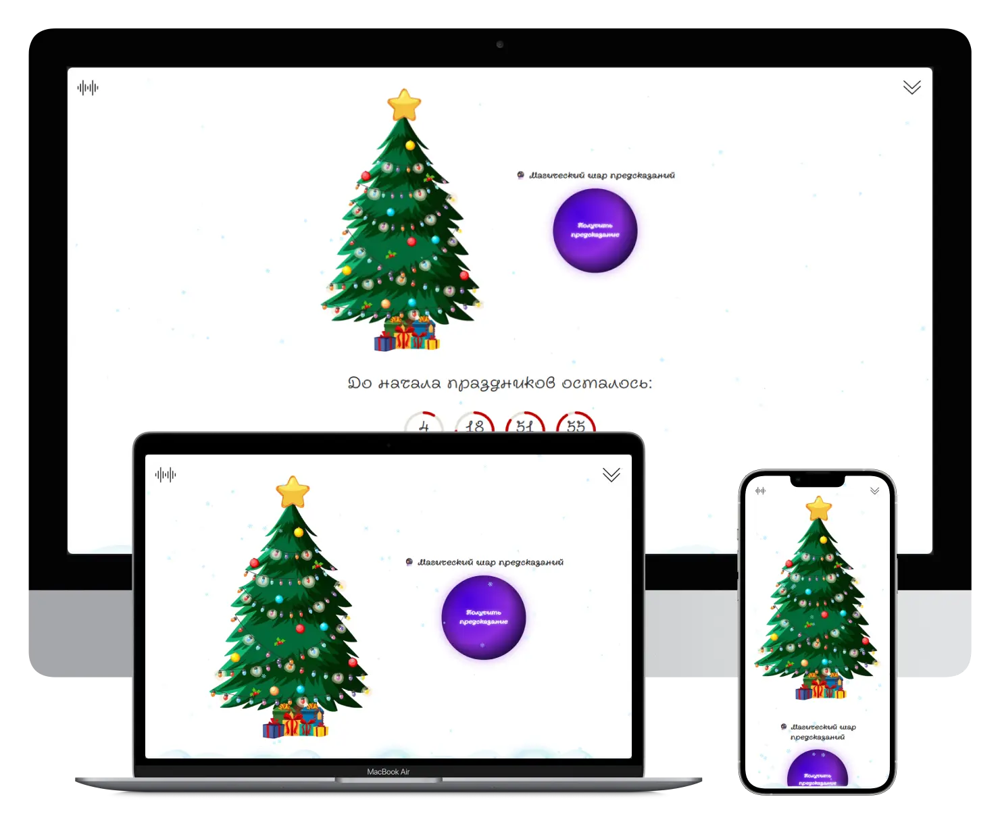

# New Year Countdown

[🇬🇧 English](#english) | [🇷🇺 Русский](#русский)

---

## English

### New Year Countdown

Project: https://countdown-training.netlify.app/

Personal project for fun

A project with a countdown to the New Year, snow animation and fun music to cheer up the New Year mood.

---

### About the project

#### Pages:

- Main

#### Functionality:

- The counter and calendar are made in pure JS
- Turning music on and off
- Snowfall
- Adaptability to different devices

#### Not Implemented:

- Garland
- Music streaming

---

### License

This project is licensed under the [GNU Affero General Public License v3 (AGPLv3)](https://www.gnu.org/licenses/agpl-3.0.html).

---

### Contacts

Author: Yuriy Plotnikov  
Website: https://yuriyplotnikovv.ru  

---

## Русский

### Счётчик до Нового Года

Проект: https://countdown-training.netlify.app/

Личный проект для развлечения

Проект с обратным отсчётом до Нового года, анимацией снега и веселой музыкой для поднятия Новогоднего настроения.

---

### О проекте

#### Страницы:

- Главная

#### Функциональность:

- Счётчик и календарь выполнены на чистом JS
- Включение и выключение музыки
- Снегопад
- Адаптивность под разные устройства

#### Не реализовано:

- Гирлянда
- Шар предсказаний
- Потоковое воспроизведение музыки

---

### Лицензия

Проект распространяется под лицензией [GNU Affero General Public License v3 (AGPLv3)](https://www.gnu.org/licenses/agpl-3.0.html).

---

### Контакты

Автор: Yuriy Plotnikov  
Сайт: https://yuriyplotnikovv.ru  
